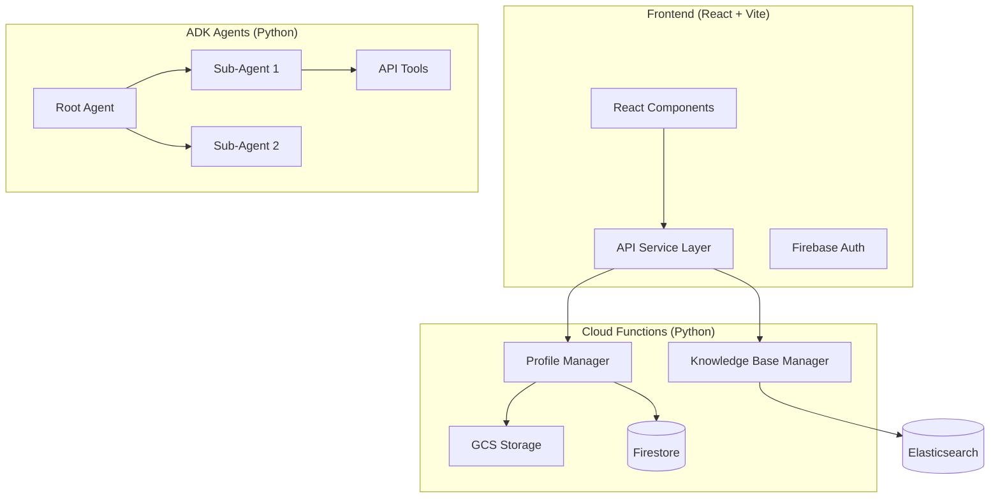

# Full-Stack AI Application Blueprint

A reusable architectural pattern for building AI-powered applications with:
- **ADK Agents** (Google Agent Development Kit) for data collection and processing
- **Cloud Functions** with Firestore for backend API
- **React Frontend** for user interface

---

## Architecture Overview



---

## 1. ADK Agent Architecture

### 1.1 Directory Structure

```
agents/
└── your_agent/
    ├── __init__.py
    ├── agent.py              # Root agent orchestrator
    ├── model.py              # Pydantic data models (output schema)
    ├── tools.py              # Custom tools (file I/O, API calls)
    ├── api_tools.py          # External API wrappers
    ├── requirements.txt
    └── sub_agents/
        ├── __init__.py
        ├── shared_logging.py # Logging callbacks
        ├── state_initializer.py
        ├── data_collector_agent.py
        ├── aggregator_agent.py
        └── file_saver.py
```

### 1.2 Root Agent Pattern

The root agent orchestrates sub-agents using `SequentialAgent`, `ParallelAgent`, and `AgentTool`:

```python
# agent.py
from google.adk.agents import LlmAgent, ParallelAgent, SequentialAgent
from google.adk.tools import AgentTool

from .sub_agents import (
    state_initializer,
    data_collector_agent,
    aggregator_agent,
    file_saver_agent
)

MODEL_NAME = "gemini-2.5-flash"

# 1. Parallel data collection phase
research_phase = ParallelAgent(
    name="DataCollectionPhase",
    sub_agents=[
        data_collector_agent,      # LlmAgent with tools
        api_data_agent,            # LlmAgent with API tools
    ]
)

# 2. Sequential build and save phase
build_and_save_pipeline = SequentialAgent(
    name="BuildAndSavePipeline",
    sub_agents=[
        aggregator_agent,          # Combines all outputs
        file_saver_agent           # Saves to GCS
    ]
)

# 3. Root orchestrator
root_agent = LlmAgent(
    name="YourAgent",
    model=MODEL_NAME,
    description="Orchestrates data collection workflow.",
    instruction="""You coordinate data collection:
    1. Call DataCollector to gather information
    2. Call Aggregator to combine results
    3. Call FileSaver to persist output
    """,
    tools=[
        AgentTool(agent=SequentialAgent(
            name="FullPipeline",
            sub_agents=[state_initializer, research_phase, build_and_save_pipeline]
        ))
    ]
)
```

### 1.3 Sub-Agent Pattern (Micro-Agent + Aggregator)

Each sub-agent uses the **ParallelAgent + Aggregator** pattern for focused, reliable data collection:

```python
# sub_agents/data_collector_agent.py
from google.adk.agents import LlmAgent, ParallelAgent, SequentialAgent
from google.adk.tools import google_search

MODEL_NAME = "gemini-2.5-flash"

# Micro-agent 1: Fetch specific data type
metadata_micro = LlmAgent(
    name="MetadataMicro",
    model=MODEL_NAME,
    description="Fetches basic metadata.",
    instruction="""Research metadata for {target_name}:
    1. field_one (str): Description
    2. field_two (int): Description
    
    Search: "{target_name} official site"
    
    OUTPUT (JSON):
    {"field_one": "value", "field_two": 123}
    """,
    tools=[google_search],
    output_key="metadata"
)

# Micro-agent 2: Fetch different data type
details_micro = LlmAgent(
    name="DetailsMicro",
    model=MODEL_NAME,
    description="Fetches detailed information.",
    instruction="""Research details for {target_name}...""",
    tools=[google_search],
    output_key="details"
)

# Parallel collector
parallel_collector = ParallelAgent(
    name="ParallelCollector",
    sub_agents=[metadata_micro, details_micro]
)

# Aggregator combines all micro-agent outputs
aggregator = LlmAgent(
    name="DataAggregator",
    model=MODEL_NAME,
    description="Aggregates all micro-agent outputs.",
    instruction="""Combine outputs into final structure:
    {
        "metadata": <from metadata>,
        "details": <from details>
    }
    """,
    output_key="final_output"
)

# Export as Sequential: collect then aggregate
data_collector_agent = SequentialAgent(
    name="DataCollector",
    sub_agents=[parallel_collector, aggregator]
)
```

### 1.4 Pydantic Data Models

Define output schemas with field-level documentation:

```python
# model.py
from typing import List, Optional
from pydantic import BaseModel, Field

class Location(BaseModel):
    """Geographic location."""
    city: str = Field(
        description="[REQUIRED] City name. Source: Official website."
    )
    state: str = Field(
        description="[REQUIRED] State abbreviation."
    )

class Metadata(BaseModel):
    """Basic identifying information."""
    name: str = Field(
        description="[REQUIRED] Official name."
    )
    location: Location = Field(
        description="[REQUIRED] Geographic location."
    )
    last_updated: str = Field(
        description="[REQUIRED] ISO date. Auto-generated."
    )

class DetailItem(BaseModel):
    """A detail record."""
    category: str = Field(
        description="[REQUIRED] Category type."
    )
    value: Optional[float] = Field(
        default=None,
        description="[OPTIONAL] Numeric value."
    )
    notes: str = Field(
        default="",
        description="[OPTIONAL] Additional notes."
    )

class FullProfile(BaseModel):
    """Complete data profile."""
    metadata: Metadata
    details: List[DetailItem] = Field(default=[])
```

### 1.5 Custom Tools

```python
# tools.py
import os
import json
from google.adk.tools import ToolContext
from google.cloud import storage

GCS_BUCKET = os.environ.get("RESEARCH_BUCKET", "your-bucket")
GCS_PREFIX = "profiles/"

def get_gcs_client():
    try:
        return storage.Client()
    except Exception:
        return None

def write_file(
    tool_context: ToolContext,
    filename: str,
    content: str
) -> dict:
    """
    Writes content to GCS.
    
    Args:
        filename: Name of file (e.g., 'item_123.json')
        content: JSON content to write
    
    Returns:
        dict with status and gcs_uri
    """
    gcs_client = get_gcs_client()
    if not gcs_client:
        return {"error": "GCS not available"}
    
    bucket = gcs_client.bucket(GCS_BUCKET)
    blob = bucket.blob(f"{GCS_PREFIX}{filename}")
    blob.upload_from_string(content, content_type="application/json")
    
    return {
        "status": "success",
        "gcs_uri": f"gs://{GCS_BUCKET}/{GCS_PREFIX}{filename}"
    }
```

### 1.6 API Tools (External APIs)

```python
# api_tools.py
import os
import requests
from google.adk.tools import ToolContext

API_BASE_URL = "https://api.example.com/v1"
API_KEY = os.getenv("EXAMPLE_API_KEY", "")

def get_external_data(
    tool_context: ToolContext,
    item_id: str
) -> dict:
    """
    Fetch data from external API.
    
    Args:
        item_id: ID to look up
        
    Returns:
        Dictionary with API data
    """
    if not API_KEY:
        return {"error": "No API key configured"}
    
    try:
        response = requests.get(
            f"{API_BASE_URL}/items/{item_id}",
            headers={"Authorization": f"Bearer {API_KEY}"},
            timeout=30
        )
        response.raise_for_status()
        return response.json()
    except Exception as e:
        return {"error": str(e)}
```

---

## 2. Cloud Functions with Firestore

### 2.1 Directory Structure

```
cloud_functions/
└── profile_manager/
    ├── main.py               # HTTP entry point + routing
    ├── firestore_db.py       # Firestore abstraction layer
    ├── gcs_storage.py        # GCS file operations
    ├── file_processing.py    # PDF/DOCX text extraction
    ├── llm_processing.py     # Gemini AI integration
    ├── operations.py         # Business logic
    ├── credits.py            # Credit/billing management
    ├── env.yaml              # Local environment
    ├── env.deploy.yaml       # Production environment (generated)
    └── requirements.txt
```

### 2.2 Main Entry Point (Complete HTTP Router)

```python
# main.py
import os
import logging
import json
import functions_framework
from flask import make_response

# Import all modules
from firestore_db import get_db
from gcs_storage import (
    upload_file_to_gcs, download_file_from_gcs, 
    delete_file_from_gcs, list_user_files
)
from file_processing import extract_text_from_file
from llm_processing import (
    extract_profile_content, convert_to_markdown,
    extract_structured_data
)
from operations import (
    get_profile, save_profile, get_list, add_to_list,
    remove_from_list, update_list_item
)
from credits import (
    get_user_credits, check_credits_available,
    deduct_credit, add_credits, upgrade_subscription
)

logger = logging.getLogger(__name__)

# Configuration
GCP_PROJECT_ID = os.getenv("GCP_PROJECT_ID")
GCS_BUCKET_NAME = os.getenv("GCS_BUCKET_NAME")
GEMINI_API_KEY = os.getenv("GEMINI_API_KEY")

logger.info(f"[INIT] Service starting - Project: {GCP_PROJECT_ID}")


# ============== CORS HELPER ==============
def add_cors_headers(response_data, status_code=200):
    """Add CORS headers to response."""
    response = make_response(json.dumps(response_data), status_code)
    response.headers['Content-Type'] = 'application/json'
    response.headers['Access-Control-Allow-Origin'] = '*'
    response.headers['Access-Control-Allow-Methods'] = 'GET, POST, PUT, DELETE, OPTIONS'
    response.headers['Access-Control-Allow-Headers'] = 'Content-Type, Authorization, X-User-Email'
    return response


# ============== MAIN ENTRY POINT ==============
@functions_framework.http
def http_entry(request):
    """HTTP Cloud Function entry point."""
    
    # Handle CORS preflight
    if request.method == 'OPTIONS':
        return add_cors_headers({'status': 'ok'}, 200)
    
    # Parse resource from path
    path_parts = request.path.strip('/').split('/')
    if not path_parts:
        return add_cors_headers({'error': 'Not Found'}, 404)
    
    resource_type = path_parts[0]
    logger.info(f"Processing {request.method} {resource_type}")
    
    try:
        # === HEALTH CHECK ===
        if resource_type == 'health':
            return add_cors_headers({
                'status': 'healthy',
                'service': 'profile_manager',
                'backend': 'firestore',
                'version': '1.0.0'
            })
        
        # === FILE UPLOAD WITH LLM PROCESSING ===
        elif resource_type == 'upload-profile' and request.method == 'POST':
            return handle_file_upload(request)
        
        # === LIST USER FILES ===
        elif resource_type == 'list-profiles':
            user_id = request.args.get('user_email')
            if not user_id:
                return add_cors_headers({'error': 'user_email required'}, 400)
            
            files = list_user_files(user_id)
            return add_cors_headers({
                'success': True,
                'documents': files,
                'total': len(files)
            })
        
        # === DOWNLOAD FILE ===
        elif resource_type == 'download-document':
            user_id = request.args.get('user_email')
            filename = request.args.get('filename')
            
            if not user_id or not filename:
                return add_cors_headers({'error': 'user_email and filename required'}, 400)
            
            result = download_file_from_gcs(user_id, filename)
            if result['success']:
                from flask import send_file
                import io
                return send_file(
                    io.BytesIO(result['file_content']),
                    mimetype=result.get('content_type', 'application/octet-stream'),
                    as_attachment=True,
                    download_name=filename
                )
            return add_cors_headers(result, 404)
        
        # === GET PROFILE ===
        elif resource_type == 'get-profile':
            user_id = _get_user_id(request)
            if not user_id:
                return add_cors_headers({'error': 'user_email required'}, 400)
            
            profile = get_profile(user_id)
            if profile:
                return add_cors_headers({
                    'success': True,
                    'profile': profile
                })
            return add_cors_headers({'success': False, 'error': 'Not found'}, 404)
        
        # === SAVE PROFILE ===
        elif resource_type == 'save-profile' and request.method == 'POST':
            data = request.get_json()
            user_id = data.get('user_email')
            profile_data = data.get('profile')
            
            if not user_id or not profile_data:
                return add_cors_headers({'error': 'user_email and profile required'}, 400)
            
            result = save_profile(user_id, profile_data)
            return add_cors_headers(result)
        
        # === LIST MANAGEMENT ===
        elif resource_type == 'get-list':
            user_id = _get_user_id(request)
            if not user_id:
                return add_cors_headers({'error': 'user_email required'}, 400)
            
            items = get_list(user_id)
            return add_cors_headers({
                'success': True,
                'items': items
            })
        
        elif resource_type == 'add-to-list' and request.method == 'POST':
            data = request.get_json()
            user_id = data.get('user_email')
            item_id = data.get('item_id')
            
            if not user_id or not item_id:
                return add_cors_headers({'error': 'user_email and item_id required'}, 400)
            
            result = add_to_list(user_id, item_id, data)
            return add_cors_headers(result)
        
        elif resource_type == 'remove-from-list' and request.method in ['POST', 'DELETE']:
            data = request.get_json()
            result = remove_from_list(data.get('user_email'), data.get('item_id'))
            return add_cors_headers(result)
        
        # === CREDITS/BILLING ===
        elif resource_type == 'get-credits':
            user_id = _get_user_id(request)
            credits = get_user_credits(user_id)
            return add_cors_headers({'success': True, 'credits': credits})
        
        elif resource_type == 'check-credits' and request.method == 'POST':
            data = request.get_json()
            result = check_credits_available(
                data.get('user_email'),
                data.get('credits_needed', 1)
            )
            return add_cors_headers({'success': True, **result})
        
        elif resource_type == 'deduct-credit' and request.method == 'POST':
            data = request.get_json()
            result = deduct_credit(
                data.get('user_email'),
                data.get('credit_count', 1),
                data.get('reason', 'usage')
            )
            return add_cors_headers(result)
        
        else:
            return add_cors_headers({'error': f'Unknown: {resource_type}'}, 404)
    
    except Exception as e:
        logger.error(f"Request failed: {e}", exc_info=True)
        return add_cors_headers({'success': False, 'error': str(e)}, 500)


# ============== HELPER FUNCTIONS ==============
def _get_user_id(request):
    """Extract user ID from request (header, body, or query param)."""
    if request.method == 'POST':
        data = request.get_json() or {}
        return data.get('user_email') or data.get('user_id')
    return request.args.get('user_email') or request.args.get('user_id')


def handle_file_upload(request):
    """Handle file upload with LLM processing."""
    try:
        user_id = request.headers.get('X-User-Email') or request.form.get('user_email')
        if not user_id:
            return add_cors_headers({'error': 'user_email required'}, 400)
        
        if 'file' not in request.files:
            return add_cors_headers({'error': 'No file uploaded'}, 400)
        
        file = request.files['file']
        if file.filename == '':
            return add_cors_headers({'error': 'Empty filename'}, 400)
        
        file_content = file.read()
        filename = file.filename
        content_type = file.content_type
        
        logger.info(f"[UPLOAD] Processing {filename} for {user_id}")
        
        # 1. Extract text from file
        raw_text = extract_text_from_file(file_content, filename, content_type)
        
        # 2. Process with LLM
        processed = extract_profile_content(raw_text, filename)
        
        # 3. Save to GCS
        upload_result = upload_file_to_gcs(
            user_id, filename, file_content, content_type
        )
        
        # 4. Save processed data to Firestore
        db = get_db()
        db.save_profile(user_id, {
            'raw_content': processed.get('raw_content'),
            'content_markdown': processed.get('content_markdown'),
            'structured_profile': processed.get('structured_profile'),
            'original_filename': filename,
            'gcs_uri': upload_result.get('gcs_uri')
        })
        
        return add_cors_headers({
            'success': True,
            'message': f'Processed {filename}',
            'structured_profile': processed.get('structured_profile')
        })
        
    except Exception as e:
        logger.error(f"[UPLOAD] Error: {e}", exc_info=True)
        return add_cors_headers({'success': False, 'error': str(e)}, 500)
```

### 2.3 Firestore Database Layer (Complete)

```python
# firestore_db.py
import os
import logging
from datetime import datetime
from typing import Dict, List, Optional, Any
from google.cloud import firestore

logger = logging.getLogger(__name__)


class FirestoreDB:
    """Firestore database client with all CRUD operations."""
    
    def __init__(self):
        self.db = firestore.Client()
        logger.info("[Firestore] Client initialized")
    
    # ========== PROFILE OPERATIONS ==========
    def get_profile(self, user_id: str) -> Optional[Dict]:
        """Get user's profile document."""
        try:
            doc = self.db.collection('profiles').document(user_id).get()
            return doc.to_dict() if doc.exists else None
        except Exception as e:
            logger.error(f"Get profile failed: {e}")
            return None
    
    def save_profile(self, user_id: str, data: Dict, merge: bool = True) -> bool:
        """Save or update profile."""
        try:
            data['updated_at'] = datetime.utcnow().isoformat()
            self.db.collection('profiles').document(user_id).set(data, merge=merge)
            return True
        except Exception as e:
            logger.error(f"Save profile failed: {e}")
            return False
    
    def delete_profile(self, user_id: str) -> bool:
        """Delete user's entire profile and subcollections."""
        try:
            doc_ref = self.db.collection('profiles').document(user_id)
            
            # Delete subcollections first
            for subcoll in ['list', 'fits', 'files', 'conversations']:
                self._delete_collection(doc_ref.collection(subcoll))
            
            doc_ref.delete()
            return True
        except Exception as e:
            logger.error(f"Delete profile failed: {e}")
            return False
    
    def _delete_collection(self, coll_ref, batch_size=50):
        """Delete all documents in a collection."""
        docs = coll_ref.limit(batch_size).stream()
        deleted = 0
        for doc in docs:
            doc.reference.delete()
            deleted += 1
        if deleted >= batch_size:
            self._delete_collection(coll_ref, batch_size)
    
    # ========== LIST OPERATIONS (Subcollection) ==========
    def add_to_list(self, user_id: str, item_id: str, data: Dict) -> bool:
        """Add item to user's list subcollection."""
        try:
            data['added_at'] = datetime.utcnow().isoformat()
            self.db.collection('profiles').document(user_id)\
                   .collection('list').document(item_id).set(data, merge=True)
            return True
        except Exception as e:
            logger.error(f"Add to list failed: {e}")
            return False
    
    def get_list(self, user_id: str) -> List[Dict]:
        """Get user's list."""
        try:
            docs = self.db.collection('profiles').document(user_id)\
                          .collection('list').stream()
            return [{'id': doc.id, **doc.to_dict()} for doc in docs]
        except Exception as e:
            logger.error(f"Get list failed: {e}")
            return []
    
    def remove_from_list(self, user_id: str, item_id: str) -> bool:
        """Remove item from list."""
        try:
            self.db.collection('profiles').document(user_id)\
                   .collection('list').document(item_id).delete()
            return True
        except Exception as e:
            logger.error(f"Remove from list failed: {e}")
            return False
    
    # ========== FITS/ANALYSIS OPERATIONS ==========
    def save_fit(self, user_id: str, item_id: str, fit_data: Dict) -> bool:
        """Save analysis result."""
        try:
            fit_data['computed_at'] = datetime.utcnow().isoformat()
            self.db.collection('profiles').document(user_id)\
                   .collection('fits').document(item_id).set(fit_data, merge=True)
            return True
        except Exception as e:
            logger.error(f"Save fit failed: {e}")
            return False
    
    def get_fit(self, user_id: str, item_id: str) -> Optional[Dict]:
        """Get single analysis."""
        try:
            doc = self.db.collection('profiles').document(user_id)\
                         .collection('fits').document(item_id).get()
            return doc.to_dict() if doc.exists else None
        except Exception as e:
            logger.error(f"Get fit failed: {e}")
            return None
    
    def get_all_fits(self, user_id: str) -> List[Dict]:
        """Get all analyses for user."""
        try:
            docs = self.db.collection('profiles').document(user_id)\
                          .collection('fits').stream()
            return [{'id': doc.id, **doc.to_dict()} for doc in docs]
        except Exception as e:
            logger.error(f"Get all fits failed: {e}")
            return []
    
    # ========== CREDITS OPERATIONS ==========
    def get_credits(self, user_id: str) -> Optional[Dict]:
        """Get user's credit information."""
        try:
            doc = self.db.collection('credits').document(user_id).get()
            return doc.to_dict() if doc.exists else None
        except Exception as e:
            logger.error(f"Get credits failed: {e}")
            return None
    
    def save_credits(self, user_id: str, credits_data: Dict) -> bool:
        """Save user's credit information."""
        try:
            credits_data['updated_at'] = datetime.utcnow().isoformat()
            self.db.collection('credits').document(user_id).set(credits_data, merge=True)
            return True
        except Exception as e:
            logger.error(f"Save credits failed: {e}")
            return False
    
    # ========== FILE METADATA ==========
    def save_file_metadata(self, user_id: str, file_id: str, metadata: Dict) -> bool:
        """Save file metadata to files subcollection."""
        try:
            metadata['uploaded_at'] = datetime.utcnow().isoformat()
            self.db.collection('profiles').document(user_id)\
                   .collection('files').document(file_id).set(metadata)
            return True
        except Exception as e:
            logger.error(f"Save file metadata failed: {e}")
            return False
    
    def list_files(self, user_id: str) -> List[Dict]:
        """List all files for a user."""
        try:
            docs = self.db.collection('profiles').document(user_id)\
                          .collection('files').stream()
            return [doc.to_dict() for doc in docs]
        except Exception as e:
            logger.error(f"List files failed: {e}")
            return []


# ========== SINGLETON ==========
_db_instance = None

def get_db() -> FirestoreDB:
    """Get or create Firestore instance."""
    global _db_instance
    if _db_instance is None:
        _db_instance = FirestoreDB()
    return _db_instance
```

### 2.4 GCS Storage Layer

```python
# gcs_storage.py
import os
import logging
from datetime import timedelta
from google.cloud import storage

logger = logging.getLogger(__name__)

GCS_BUCKET = os.getenv("GCS_BUCKET_NAME", "your-bucket")


def get_storage_client():
    """Get GCS client."""
    try:
        return storage.Client()
    except Exception as e:
        logger.error(f"GCS client error: {e}")
        return None


def upload_file_to_gcs(user_id: str, filename: str, content: bytes, content_type: str) -> dict:
    """Upload file to GCS under user's folder."""
    client = get_storage_client()
    if not client:
        return {"success": False, "error": "GCS unavailable"}
    
    try:
        bucket = client.bucket(GCS_BUCKET)
        blob_path = f"users/{user_id}/files/{filename}"
        blob = bucket.blob(blob_path)
        blob.upload_from_string(content, content_type=content_type)
        
        return {
            "success": True,
            "gcs_uri": f"gs://{GCS_BUCKET}/{blob_path}",
            "public_url": f"https://storage.googleapis.com/{GCS_BUCKET}/{blob_path}"
        }
    except Exception as e:
        logger.error(f"Upload failed: {e}")
        return {"success": False, "error": str(e)}


def download_file_from_gcs(user_id: str, filename: str) -> dict:
    """Download file from GCS."""
    client = get_storage_client()
    if not client:
        return {"success": False, "error": "GCS unavailable"}
    
    try:
        bucket = client.bucket(GCS_BUCKET)
        blob = bucket.blob(f"users/{user_id}/files/{filename}")
        
        if not blob.exists():
            return {"success": False, "error": "File not found"}
        
        content = blob.download_as_bytes()
        
        return {
            "success": True,
            "file_content": content,
            "content_type": blob.content_type,
            "size": blob.size
        }
    except Exception as e:
        logger.error(f"Download failed: {e}")
        return {"success": False, "error": str(e)}


def delete_file_from_gcs(user_id: str, filename: str) -> dict:
    """Delete file from GCS."""
    client = get_storage_client()
    if not client:
        return {"success": False, "error": "GCS unavailable"}
    
    try:
        bucket = client.bucket(GCS_BUCKET)
        blob = bucket.blob(f"users/{user_id}/files/{filename}")
        blob.delete()
        return {"success": True, "message": f"Deleted {filename}"}
    except Exception as e:
        logger.error(f"Delete failed: {e}")
        return {"success": False, "error": str(e)}


def list_user_files(user_id: str) -> list:
    """List all files for a user."""
    client = get_storage_client()
    if not client:
        return []
    
    try:
        bucket = client.bucket(GCS_BUCKET)
        prefix = f"users/{user_id}/files/"
        blobs = bucket.list_blobs(prefix=prefix)
        
        files = []
        for blob in blobs:
            files.append({
                "filename": blob.name.replace(prefix, ""),
                "size": blob.size,
                "content_type": blob.content_type,
                "updated": blob.updated.isoformat() if blob.updated else None,
                "gcs_uri": f"gs://{GCS_BUCKET}/{blob.name}"
            })
        return files
    except Exception as e:
        logger.error(f"List files failed: {e}")
        return []


def get_signed_url(user_id: str, filename: str, expiration_minutes: int = 60) -> dict:
    """Generate signed URL for secure file access."""
    client = get_storage_client()
    if not client:
        return {"success": False, "error": "GCS unavailable"}
    
    try:
        bucket = client.bucket(GCS_BUCKET)
        blob = bucket.blob(f"users/{user_id}/files/{filename}")
        
        url = blob.generate_signed_url(
            version="v4",
            expiration=timedelta(minutes=expiration_minutes),
            method="GET"
        )
        return {"success": True, "url": url}
    except Exception as e:
        logger.error(f"Signed URL failed: {e}")
        return {"success": False, "error": str(e)}
```

### 2.5 LLM Integration (Gemini)

```python
# llm_processing.py
import os
import json
import logging
from google import genai
from google.genai import types

logger = logging.getLogger(__name__)

GEMINI_API_KEY = os.getenv("GEMINI_API_KEY")


def get_gemini_client():
    """Get Gemini client."""
    if not GEMINI_API_KEY:
        raise ValueError("GEMINI_API_KEY not configured")
    return genai.Client(api_key=GEMINI_API_KEY)


def convert_to_markdown(raw_text: str, filename: str) -> str:
    """Convert raw text to clean Markdown using Gemini."""
    try:
        client = get_gemini_client()
        
        prompt = f"""Convert this document to clean, well-formatted Markdown.
        
RULES:
1. Use ## for major sections
2. Use bullet points for lists
3. Preserve all data exactly - don't add or remove info
4. Use **bold** for important labels
5. Return ONLY the Markdown, no explanation

CONTENT:
{raw_text[:20000]}
"""
        
        response = client.models.generate_content(
            model='gemini-2.0-flash-exp',
            contents=prompt,
            config=types.GenerateContentConfig(
                temperature=0.1,
                max_output_tokens=4096
            )
        )
        
        return response.text.strip() if response.text else raw_text
        
    except Exception as e:
        logger.error(f"Markdown conversion failed: {e}")
        return f"# Document\n\n{raw_text}"


def extract_structured_data(raw_text: str, schema: dict) -> dict:
    """Extract structured data from text using Gemini."""
    try:
        client = get_gemini_client()
        
        schema_str = json.dumps(schema, indent=2)
        
        prompt = f"""Extract data from this text into the specified JSON schema.
Use null for missing fields. Be thorough but accurate.

TEXT:
{raw_text[:20000]}

REQUIRED JSON SCHEMA:
{schema_str}

Return ONLY valid JSON, no explanation or markdown.
"""
        
        response = client.models.generate_content(
            model='gemini-2.0-flash-exp',
            contents=prompt,
            config=types.GenerateContentConfig(
                temperature=0.1,
                max_output_tokens=4096
            )
        )
        
        result_text = response.text.strip()
        
        # Clean markdown if present
        if result_text.startswith("```"):
            result_text = result_text.split("```")[1]
            if result_text.startswith("json"):
                result_text = result_text[4:]
        
        return json.loads(result_text)
        
    except Exception as e:
        logger.error(f"Structured extraction failed: {e}")
        return None


def extract_profile_content(raw_text: str, filename: str) -> dict:
    """Full processing pipeline: text -> markdown + structured data."""
    try:
        # 1. Convert to Markdown
        content_markdown = convert_to_markdown(raw_text, filename)
        
        # 2. Define extraction schema
        schema = {
            "name": "string or null",
            "email": "string or null",
            "location": "string or null",
            "summary": "string or null",
            "skills": ["list of strings"],
            "experience": [{"title": "str", "company": "str", "duration": "str"}],
            "education": [{"degree": "str", "school": "str", "year": "str"}]
        }
        
        # 3. Extract structured data
        structured_profile = extract_structured_data(raw_text, schema)
        
        return {
            "raw_content": raw_text,
            "content_markdown": content_markdown,
            "structured_profile": structured_profile,
            "filename": filename
        }
        
    except Exception as e:
        logger.error(f"Profile extraction failed: {e}")
        return {
            "raw_content": raw_text,
            "content_markdown": f"# Document\n\nError: {str(e)}",
            "structured_profile": None,
            "error": str(e)
        }
```

### 2.6 Credits/Billing Management

```python
# credits.py
import logging
from datetime import datetime, timedelta
from typing import Dict
from firestore_db import get_db

logger = logging.getLogger(__name__)

# Configuration
FREE_TIER_CREDITS = 3
MONTHLY_CREDITS = 20
ANNUAL_CREDITS = 150
CREDIT_PACK_SIZE = 10


def get_user_credits(user_id: str) -> Dict:
    """Get user's credit balance and tier info."""
    db = get_db()
    credits = db.get_credits(user_id)
    
    if not credits:
        # Initialize new user with free tier
        credits = initialize_user_credits(user_id)
    
    # Check subscription expiration
    if credits.get('subscription_expires'):
        exp_date = datetime.fromisoformat(credits['subscription_expires'])
        if datetime.utcnow() > exp_date:
            # Subscription expired, downgrade to free
            credits['tier'] = 'free'
            credits['subscription_active'] = False
            db.save_credits(user_id, credits)
    
    return credits


def initialize_user_credits(user_id: str, tier: str = "free") -> Dict:
    """Initialize credits for new user."""
    db = get_db()
    
    credits_data = {
        "user_id": user_id,
        "tier": tier,
        "credits_remaining": FREE_TIER_CREDITS if tier == "free" else MONTHLY_CREDITS,
        "credits_used": 0,
        "subscription_active": False,
        "subscription_expires": None,
        "created_at": datetime.utcnow().isoformat()
    }
    
    db.save_credits(user_id, credits_data)
    logger.info(f"[CREDITS] Initialized {tier} tier for {user_id}")
    
    return credits_data


def check_credits_available(user_id: str, credits_needed: int = 1) -> Dict:
    """Check if user has enough credits."""
    credits = get_user_credits(user_id)
    remaining = credits.get('credits_remaining', 0)
    
    return {
        "has_credits": remaining >= credits_needed,
        "credits_remaining": remaining,
        "credits_needed": credits_needed,
        "tier": credits.get('tier', 'free')
    }


def deduct_credit(user_id: str, credit_count: int = 1, reason: str = "usage") -> Dict:
    """Deduct credits from user's balance."""
    db = get_db()
    credits = get_user_credits(user_id)
    
    remaining = credits.get('credits_remaining', 0)
    
    if remaining < credit_count:
        return {
            "success": False,
            "error": "Insufficient credits",
            "credits_remaining": remaining
        }
    
    # Deduct
    credits['credits_remaining'] = remaining - credit_count
    credits['credits_used'] = credits.get('credits_used', 0) + credit_count
    credits['last_usage'] = datetime.utcnow().isoformat()
    credits['last_usage_reason'] = reason
    
    db.save_credits(user_id, credits)
    
    logger.info(f"[CREDITS] Deducted {credit_count} from {user_id}, remaining: {credits['credits_remaining']}")
    
    return {
        "success": True,
        "credits_deducted": credit_count,
        "credits_remaining": credits['credits_remaining'],
        "reason": reason
    }


def add_credits(user_id: str, credit_count: int, source: str = "credit_pack") -> Dict:
    """Add credits to user's balance."""
    db = get_db()
    credits = get_user_credits(user_id)
    
    credits['credits_remaining'] = credits.get('credits_remaining', 0) + credit_count
    credits['last_credit_add'] = datetime.utcnow().isoformat()
    credits['last_credit_source'] = source
    
    db.save_credits(user_id, credits)
    
    logger.info(f"[CREDITS] Added {credit_count} to {user_id}, new balance: {credits['credits_remaining']}")
    
    return {
        "success": True,
        "credits_added": credit_count,
        "credits_remaining": credits['credits_remaining'],
        "source": source
    }


def upgrade_subscription(user_id: str, plan_type: str = 'monthly') -> Dict:
    """Upgrade user to paid subscription."""
    db = get_db()
    credits = get_user_credits(user_id)
    
    if plan_type == 'monthly':
        credits_to_add = MONTHLY_CREDITS
        expires = datetime.utcnow() + timedelta(days=30)
    else:  # annual
        credits_to_add = ANNUAL_CREDITS
        expires = datetime.utcnow() + timedelta(days=365)
    
    credits['tier'] = 'pro'
    credits['credits_remaining'] = credits.get('credits_remaining', 0) + credits_to_add
    credits['subscription_active'] = True
    credits['subscription_expires'] = expires.isoformat()
    credits['subscription_plan'] = plan_type
    
    db.save_credits(user_id, credits)
    
    return {
        "success": True,
        "tier": "pro",
        "credits_added": credits_to_add,
        "credits_remaining": credits['credits_remaining'],
        "subscription_expires": expires.isoformat()
    }
```

### 2.7 External API Enrichment Pattern

```python
# enrichment.py
import os
import logging
import requests
from typing import Dict, List

logger = logging.getLogger(__name__)

KNOWLEDGE_BASE_URL = os.getenv("KNOWLEDGE_BASE_URL")


def enrich_list_items(items: List[Dict], item_ids: List[str]) -> List[Dict]:
    """
    Enrich list items with data from external knowledge base.
    This pattern fetches additional metadata from another service.
    """
    if not item_ids:
        return items
    
    # Fetch enrichment data from knowledge base
    enrichment_data = {}
    try:
        response = requests.post(
            KNOWLEDGE_BASE_URL,
            json={"item_ids": item_ids},
            timeout=10
        )
        
        if response.status_code == 200:
            data = response.json()
            if data.get('success') and data.get('items'):
                for item in data['items']:
                    item_id = item.get('id')
                    if item_id:
                        # Extract and format location
                        location = item.get('location', {})
                        location_str = None
                        if isinstance(location, dict):
                            city = location.get('city', '')
                            state = location.get('state', '')
                            if city and state:
                                location_str = f"{city}, {state}"
                        
                        enrichment_data[item_id] = {
                            'location': location_str,
                            'category': item.get('category'),
                            'rating': item.get('rating'),
                            'summary': item.get('summary'),
                            'image_url': item.get('image_url')
                        }
                
                logger.info(f"Enriched {len(enrichment_data)} items from KB")
    
    except Exception as e:
        logger.warning(f"Enrichment failed: {e}")
    
    # Merge enrichment data into items
    enriched_items = []
    for item in items:
        item_id = item.get('id')
        enrichment = enrichment_data.get(item_id, {})
        
        enriched_item = {
            **item,
            # Prefer enrichment data, fall back to existing
            'location': enrichment.get('location') or item.get('location'),
            'category': enrichment.get('category') or item.get('category'),
            'rating': enrichment.get('rating') or item.get('rating'),
            'summary': enrichment.get('summary') or item.get('summary'),
            'image_url': enrichment.get('image_url') or item.get('image_url')
        }
        enriched_items.append(enriched_item)
    
    return enriched_items
```

### 2.8 Requirements

```text
# requirements.txt
functions-framework==3.*
google-cloud-firestore==2.*
google-cloud-storage==2.*
google-generativeai>=0.8.0
requests>=2.28.0
PyPDF2>=3.0.0
python-docx>=0.8.11
```

### 2.9 Environment Configuration

```yaml
# env.yaml (local development)
GCP_PROJECT_ID: your-project-id
GCS_BUCKET_NAME: your-bucket
GEMINI_API_KEY: your-api-key
KNOWLEDGE_BASE_URL: http://localhost:8081
```

```yaml
# env.deploy.yaml (generated by deploy script)
GCP_PROJECT_ID: your-project-id
GCS_BUCKET_NAME: your-bucket
GEMINI_API_KEY: <fetched-from-secret-manager>
KNOWLEDGE_BASE_URL: https://knowledge-base-xxxxx.run.app
```

---

## 3. React Frontend

### 3.1 Directory Structure

```
frontend/
├── src/
│   ├── App.jsx              # Main app with routing
│   ├── main.jsx             # Entry point
│   ├── index.css            # Global styles
│   ├── firebase.js          # Firebase config
│   ├── components/
│   │   ├── common/          # Shared components
│   │   └── feature/         # Feature-specific components
│   ├── pages/
│   │   ├── Dashboard.jsx
│   │   ├── Profile.jsx
│   │   └── ListPage.jsx
│   ├── services/
│   │   └── api.js           # API service layer
│   └── context/
│       └── AuthContext.jsx  # Authentication context
├── .env                     # Environment variables
├── vite.config.js
└── package.json
```

### 3.2 API Service Layer

```javascript
// services/api.js

// Get API URLs from environment
const PROFILE_MANAGER_URL = import.meta.env.VITE_PROFILE_MANAGER_URL;
const KNOWLEDGE_BASE_URL = import.meta.env.VITE_KNOWLEDGE_BASE_URL;

console.log(`[API] Profile Manager URL: ${PROFILE_MANAGER_URL}`);

// ===== Profile Operations =====
export const getProfile = async (userId) => {
    const response = await fetch(`${PROFILE_MANAGER_URL}/get-profile?user_id=${userId}`);
    return response.json();
};

export const saveProfile = async (userId, profileData) => {
    const response = await fetch(`${PROFILE_MANAGER_URL}/save-profile`, {
        method: 'POST',
        headers: { 'Content-Type': 'application/json' },
        body: JSON.stringify({ user_id: userId, profile: profileData })
    });
    return response.json();
};

// ===== List Operations =====
export const getList = async (userId) => {
    const response = await fetch(`${PROFILE_MANAGER_URL}/get-list?user_id=${userId}`);
    return response.json();
};

export const addToList = async (userId, itemId, itemData) => {
    const response = await fetch(`${PROFILE_MANAGER_URL}/add-to-list`, {
        method: 'POST',
        headers: { 'Content-Type': 'application/json' },
        body: JSON.stringify({ user_id: userId, item_id: itemId, ...itemData })
    });
    return response.json();
};

// ===== Knowledge Base Search =====
export const searchKnowledgeBase = async (query, limit = 10) => {
    const response = await fetch(KNOWLEDGE_BASE_URL, {
        method: 'POST',
        headers: { 'Content-Type': 'application/json' },
        body: JSON.stringify({ query, limit })
    });
    return response.json();
};
```

### 3.3 Firebase Authentication Context

```javascript
// context/AuthContext.jsx
import { createContext, useContext, useEffect, useState } from 'react';
import { auth } from '../firebase';
import { onAuthStateChanged, signInWithPopup, GoogleAuthProvider, signOut } from 'firebase/auth';

const AuthContext = createContext();

export const useAuth = () => useContext(AuthContext);

export const AuthProvider = ({ children }) => {
    const [currentUser, setCurrentUser] = useState(null);
    const [loading, setLoading] = useState(true);

    useEffect(() => {
        const unsubscribe = onAuthStateChanged(auth, (user) => {
            setCurrentUser(user);
            setLoading(false);
            if (user) {
                console.log(`[AUTH] Signed in: ${user.email}`);
            }
        });
        return unsubscribe;
    }, []);

    const signInWithGoogle = async () => {
        const provider = new GoogleAuthProvider();
        return signInWithPopup(auth, provider);
    };

    const logout = () => signOut(auth);

    const value = { currentUser, signInWithGoogle, logout, loading };
    
    return (
        <AuthContext.Provider value={value}>
            {!loading && children}
        </AuthContext.Provider>
    );
};
```

### 3.4 Environment Variables

```bash
# .env
VITE_PROFILE_MANAGER_URL=https://profile-manager-xxxxx.run.app
VITE_KNOWLEDGE_BASE_URL=https://knowledge-base-xxxxx.run.app

# Firebase
VITE_FIREBASE_API_KEY=your-api-key
VITE_FIREBASE_AUTH_DOMAIN=your-project.firebaseapp.com
VITE_FIREBASE_PROJECT_ID=your-project
```

---

## 4. Deployment

### 4.1 Deployment Script Pattern

```bash
#!/bin/bash
# deploy.sh

set -e

PROJECT_ID="your-project-id"
REGION="us-east1"

# Fetch secrets
GEMINI_API_KEY=$(gcloud secrets versions access latest --secret=gemini-api-key)

# Deploy Cloud Function
deploy_function() {
    local FUNCTION_NAME=$1
    local FUNCTION_DIR=$2
    
    echo "Deploying $FUNCTION_NAME..."
    
    gcloud functions deploy $FUNCTION_NAME \
        --gen2 \
        --runtime=python311 \
        --region=$REGION \
        --source=$FUNCTION_DIR \
        --entry-point=http_entry \
        --trigger-http \
        --allow-unauthenticated \
        --memory=512MB \
        --timeout=300s \
        --set-env-vars="GEMINI_API_KEY=$GEMINI_API_KEY,GCS_BUCKET_NAME=your-bucket"
}

# Deploy Frontend
deploy_frontend() {
    echo "Deploying frontend..."
    cd frontend
    npm install
    npm run build
    firebase deploy --only hosting
    cd ..
}

# Parse target
case $1 in
    "profile") deploy_function "profile-manager" "cloud_functions/profile_manager" ;;
    "knowledge") deploy_function "knowledge-base" "cloud_functions/knowledge_base" ;;
    "frontend") deploy_frontend ;;
    "all") 
        deploy_function "profile-manager" "cloud_functions/profile_manager"
        deploy_function "knowledge-base" "cloud_functions/knowledge_base"
        deploy_frontend
        ;;
esac
```

### 4.2 Firestore Security Rules

```javascript
// firestore.rules
rules_version = '2';
service cloud.firestore {
  match /databases/{database}/documents {
    // Profiles: users can only access their own data
    match /profiles/{userId} {
      allow read, write: if request.auth != null && request.auth.token.email == userId;
      
      // Subcollections
      match /{subcollection}/{docId} {
        allow read, write: if request.auth != null && request.auth.token.email == userId;
      }
    }
  }
}
```

---

## 5. Key Patterns Summary

| Component | Pattern | Key Files |
|-----------|---------|-----------|
| **ADK Agent** | Root → ParallelAgent → SequentialAgent | `agent.py`, `sub_agents/` |
| **Sub-Agents** | Micro-agents + Aggregator | `*_agent.py` |
| **Data Models** | Pydantic with Field descriptions | `model.py` |
| **Cloud Functions** | HTTP entry + CORS + routing | `main.py` |
| **Database** | Firestore abstraction layer | `firestore_db.py` |
| **Storage** | GCS with signed URLs | `gcs_storage.py` |
| **Frontend** | API service + Auth context | `api.js`, `AuthContext.jsx` |
| **Deployment** | Modular shell script | `deploy.sh` |

---

## Quick Start Checklist

- [ ] Set up GCP project with Firestore and GCS
- [ ] Create Firebase project for authentication
- [ ] Configure Secret Manager for API keys
- [ ] Clone directory structure
- [ ] Define Pydantic models for your domain
- [ ] Implement sub-agents with micro-agent pattern
- [ ] Create Cloud Functions with Firestore layer
- [ ] Build React frontend with API service
- [ ] Deploy and test
