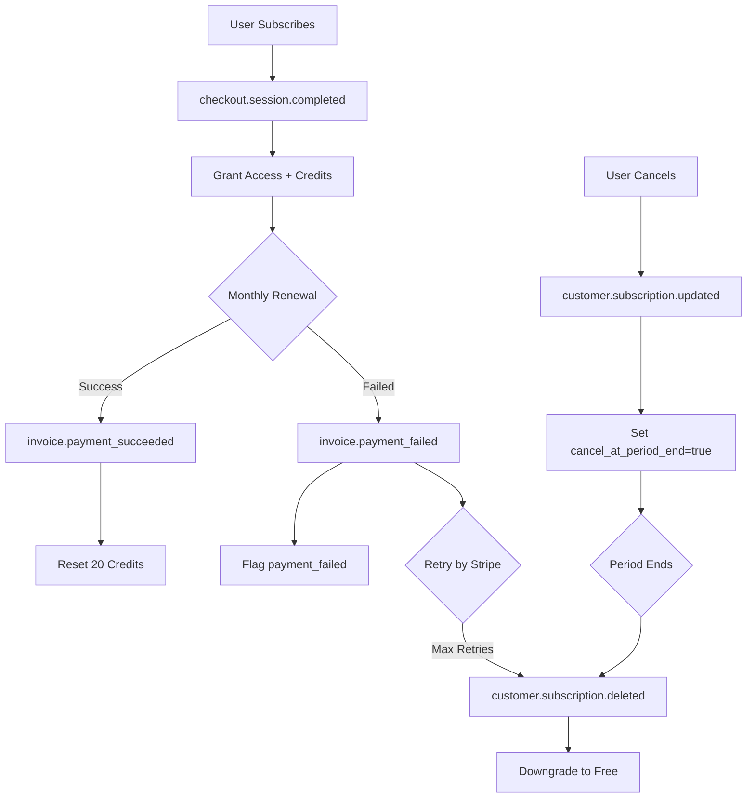

# Stripe Webhook Configuration for Production

This document outlines the required Stripe webhook configuration for Stratia Admissions.

## Required Webhook Events

Configure these events in the [Stripe Dashboard → Developers → Webhooks](https://dashboard.stripe.com/webhooks):

| Event | Purpose | Handler |
|-------|---------|---------|
| `checkout.session.completed` | Initial subscription/purchase completion | Grants access, credits |
| `customer.subscription.created` | New subscription created | Logging |
| `customer.subscription.updated` | Subscription modified (e.g., cancel scheduled) | Updates `cancel_at_period_end` |
| `customer.subscription.deleted` | Subscription ended/canceled | Downgrades to free tier |
| `invoice.payment_succeeded` | Payment successful (incl. renewals) | **Resets monthly credits** |
| `invoice.payment_failed` | Payment failed | Flags `payment_failed` status |
| `payment_intent.succeeded` | Payment intent completed | Logging |

## Endpoint URL

**Production:**
```
https://payment-manager-v2-pfnwjfp26a-ue.a.run.app/webhook
```

## Webhook Secret

The webhook secret (`whsec_...`) must be configured as `STRIPE_WEBHOOK_SECRET` in `env.yaml`.

To get/rotate the secret:
1. Go to Stripe Dashboard → Developers → Webhooks
2. Click your endpoint
3. Click "Reveal" under "Signing secret"
4. Update `env.yaml` and redeploy

## Setup Checklist

### Before Going Live

- [ ] **Webhook endpoint registered** in Stripe Dashboard
- [ ] **All required events selected** (see table above)
- [ ] **Webhook secret** configured in `env.yaml`
- [ ] **Live mode** selected (not test mode) for production
- [ ] **Test webhook delivery** using Stripe CLI

### Testing Webhooks Locally

```bash
# Install Stripe CLI
brew install stripe/stripe-cli/stripe

# Login
stripe login

# Forward webhooks to local server
stripe listen --forward-to localhost:8080/webhook

# Trigger test events
stripe trigger checkout.session.completed
stripe trigger invoice.payment_succeeded
stripe trigger invoice.payment_failed
stripe trigger customer.subscription.deleted
```

### Verify in Stripe Dashboard

After triggering test events, check:
1. Stripe Dashboard → Developers → Webhooks → Your Endpoint
2. Click "Webhook attempts" to see delivery history
3. Verify all events show "200 OK" status

## Subscription Lifecycle Flow



## Troubleshooting

### Webhook Not Receiving Events
1. Check Stripe Dashboard → Webhooks → Webhook attempts
2. Verify endpoint URL is correct and publicly accessible
3. Check Cloud Function logs for errors

### Signature Verification Failed
1. Verify `STRIPE_WEBHOOK_SECRET` matches Stripe Dashboard
2. Ensure you're using the correct endpoint's secret (not another endpoint)
3. Redeploy after updating `env.yaml`

### Credits Not Resetting on Renewal
1. Check `billing_reason` in logs - should be `subscription_cycle`
2. Verify subscription_id matches user's stored subscription
3. Check Firestore for `credits_reset_date` field
